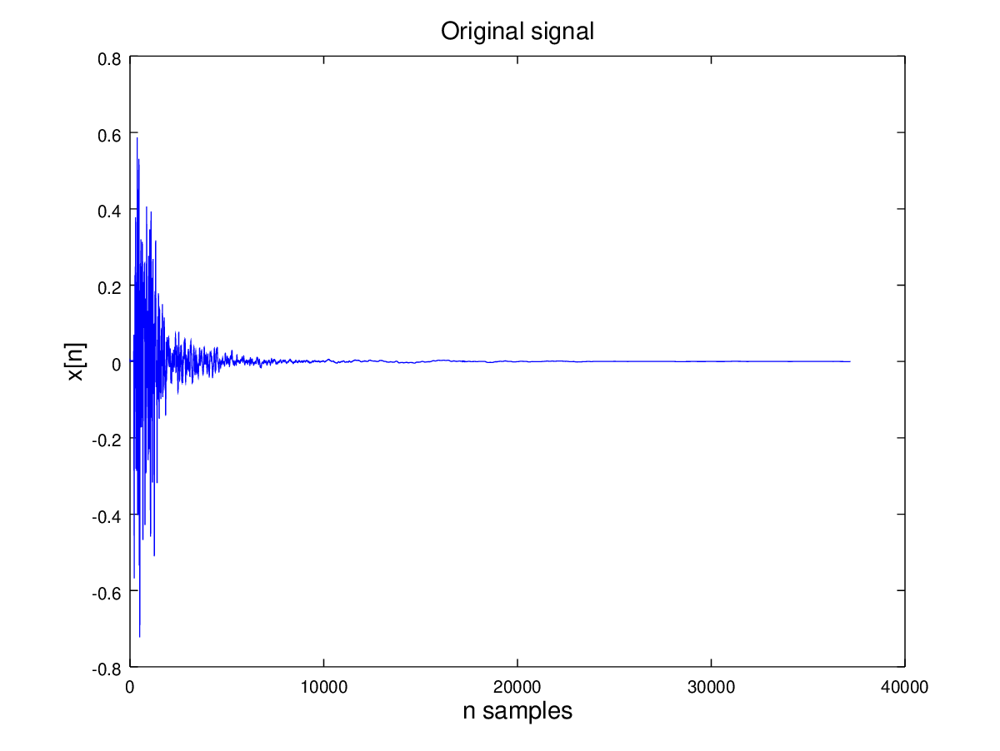
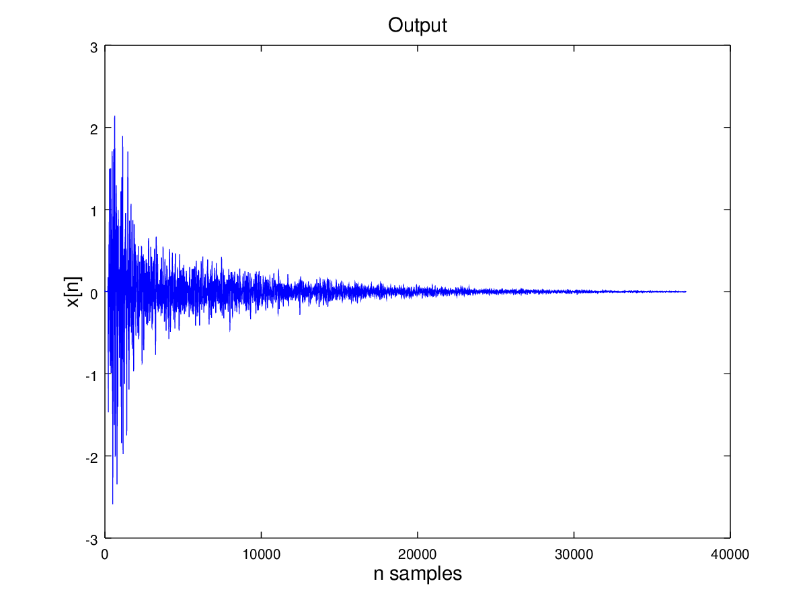
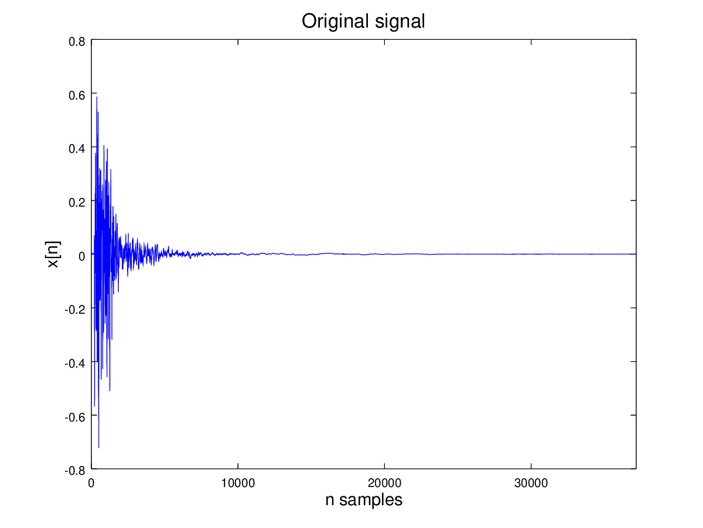
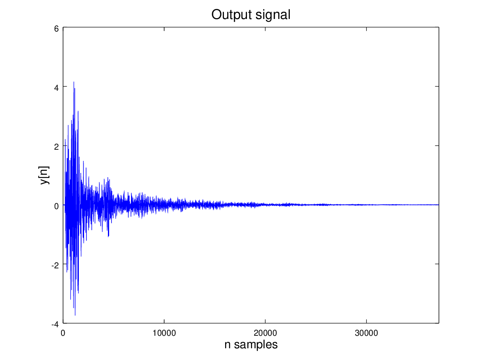

# Acoustics

Studies on classic reverb algorithms, including: Shcroeder, Moorer, Gardner. Also my own implementation with spatialization of sound features.

## Schroeder Reverb

Input signal

Output signal

## Moorer Reverb

Input signal

Output signal